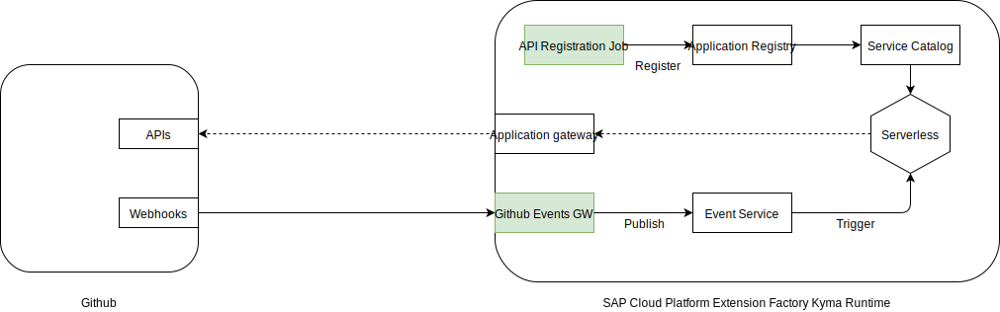

Use **Github Connector** to connect your repository webhooks with Kyma events to trigger serverless compute and make API calls from a lambda or a microservice.

**Prerequisite**

It uses the API token for makinng API calls to Github.

**Components**

